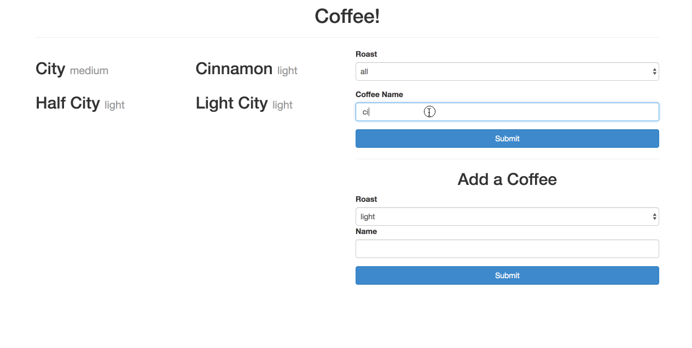

# Coffee Project

Congratulations! You have landed your first development job! You have inherited
a project from Fancy Coffee Company&copy;, and they want you to make
improvements to it.

## Setup

1. Create a Github organization and add your teammate.
1. Fork this repository (Click on the "Fork" button on the top right of this
   page) and select the new organization as a destination.
1. Clone the forked repository from your organization.
1. Open up the HTML file and check out the existing application.
1. Read through the code and understand the existing code structure before you start to build the features.

## User Stories
1. When a user visit the webpage, I expect to see a collection of coffees displayed.
2. When a user select a roast option, I expect to see coffees with the matching roast displayed on the screen.
3. When a user type a coffee name into the search field, I expect to see coffees that include the characters that have been typed.
4. When a user select a roast and provide a new coffee name and click submit, I expect the new coffee to be displayed as the last item of the collection of coffees.

## Feature List
1. Display a collection of coffee objects to the client.
2. Organizes the coffee collections by Coffee ID in ascending order.
3. Utilizes flexbox and semantic HTML for web layout.
4. Search functionality that allows users to filter coffees by name.

### Bonus Features
5. Option to select `all` roasts for roast type.
6. Provides an interactive form that allows users to add coffees to the collection of coffee objects.
7. Search input data is sanitized to account for case sensitivity.
8. Utilizes `localStorage` to locally track the current collection of coffee objects.
9. Implements Bootstrap, Materialize, or custom CSS to fully style the page.

## TODO

- Update the HTML

    Tables are a little old school, you need to refactor the code so that each
    coffee is displayed in a `div` that contains a heading displaying the coffee
    name, and the type of roast in a paragraph. Don't display the ids, these are
    only for our application's internal use

- When the page loads, the coffees should be sorted by their ids in ascending
  order

- Add functionality to search through the coffees by name, and display only the
  coffees that match the provided search term (You will need to add an input
  field to the existing form for this)

- Add functionality to update the displayed coffee as the user types into the
  search box, or as soon as they select an option from the select.

**Additional Features**

- Add an option to select all roasts for roast type

- Make your name search case insensitive

- Allow the user to add new coffees to the page

    Create another form on the page that has an input for the coffee name, and
    a select to choose the coffee roast. When the form is submitted, the new
    coffee should appear on the page. (*Note that any new coffees you add will
    be lost when you refresh the page, for an extra challenge, research
    how `localStorage` works and see if you can find a way to persist the data*)

- Style it!

    The page looks pretty plain as it is, and the refactoring we did above to
    use `div`s for coffees should give us more flexibility in styling. (*Hint:
    the styling shown in the example below can be achieved purely with bootstrap
    classes, that is, without custom CSS*)

## Example

Here is an example demonstrating the above functionality. Your application might
look different, but should have the same features.

